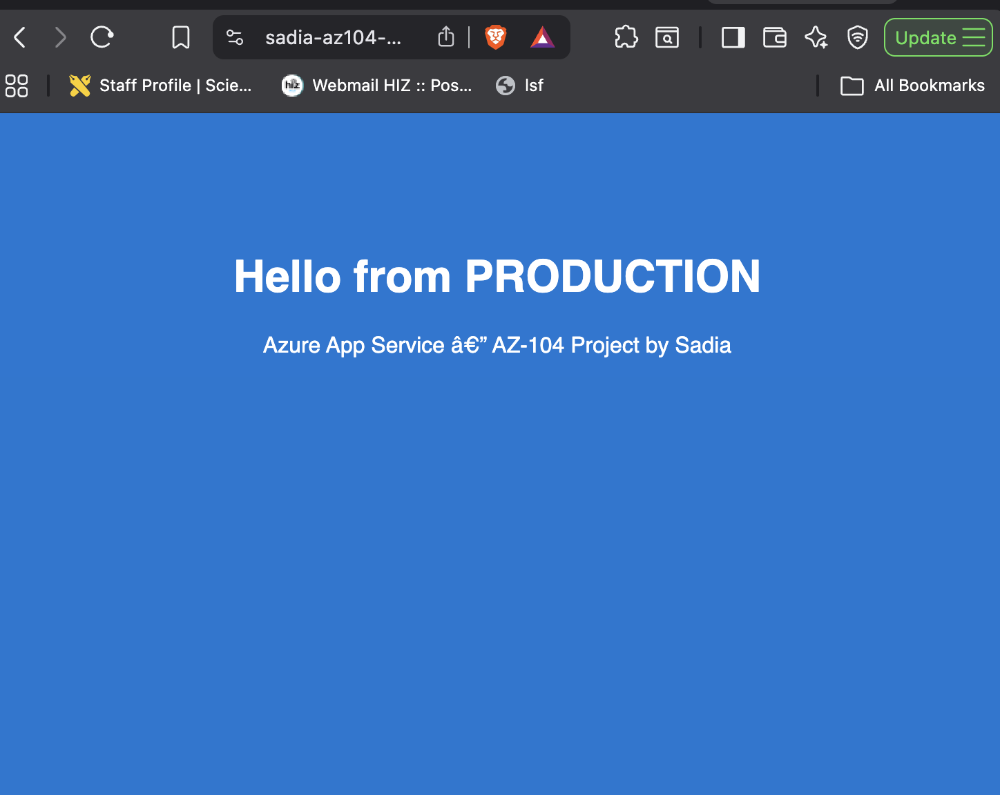
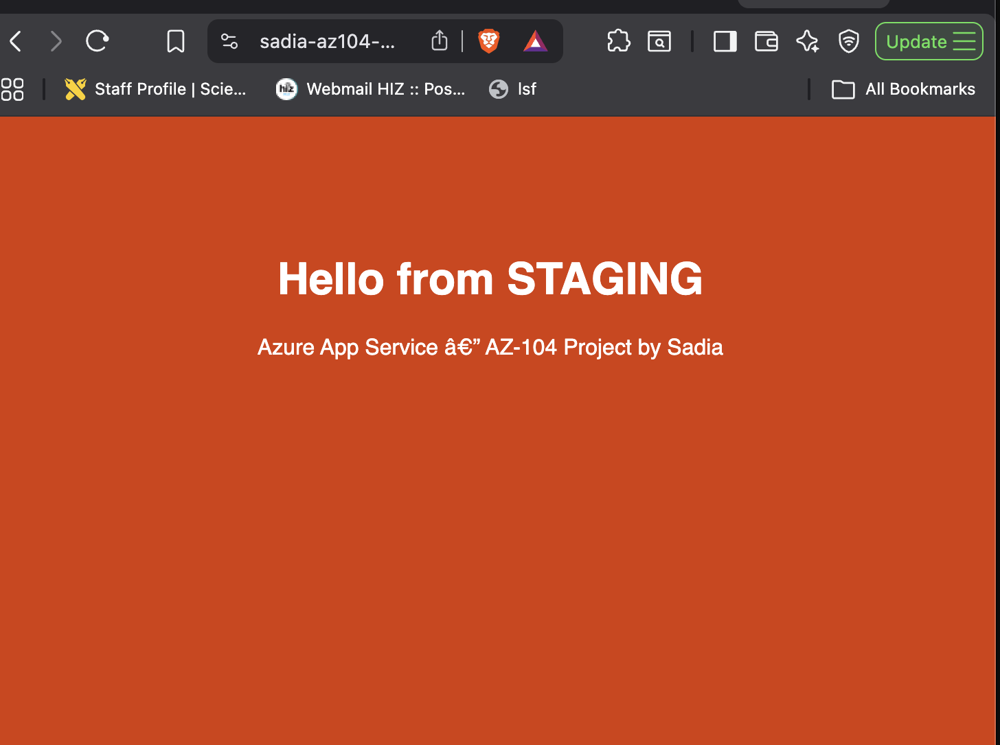
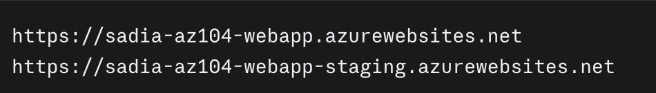
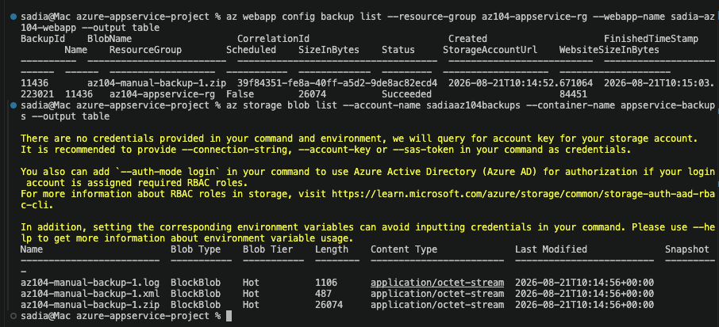
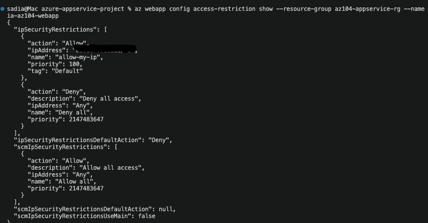
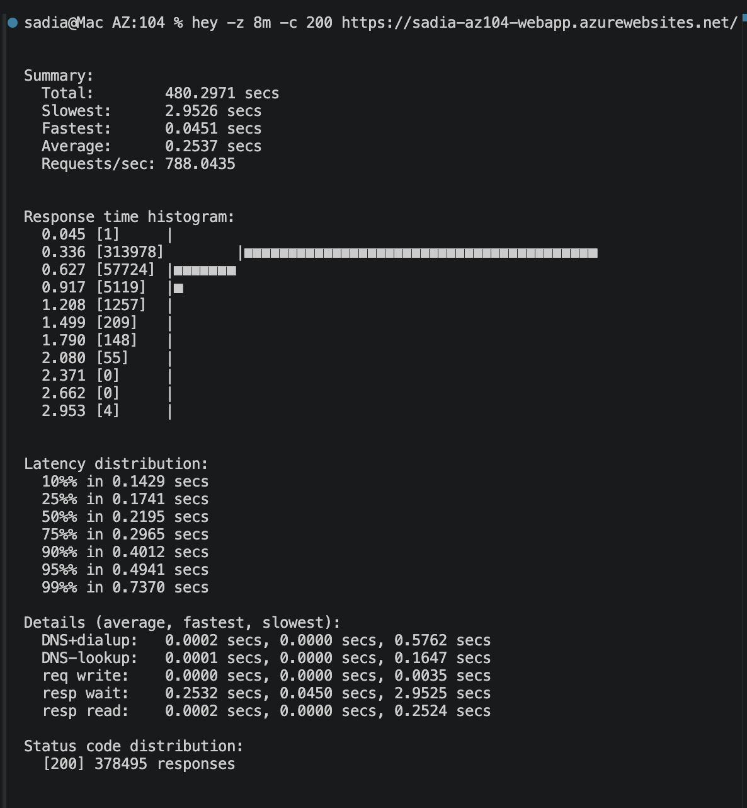
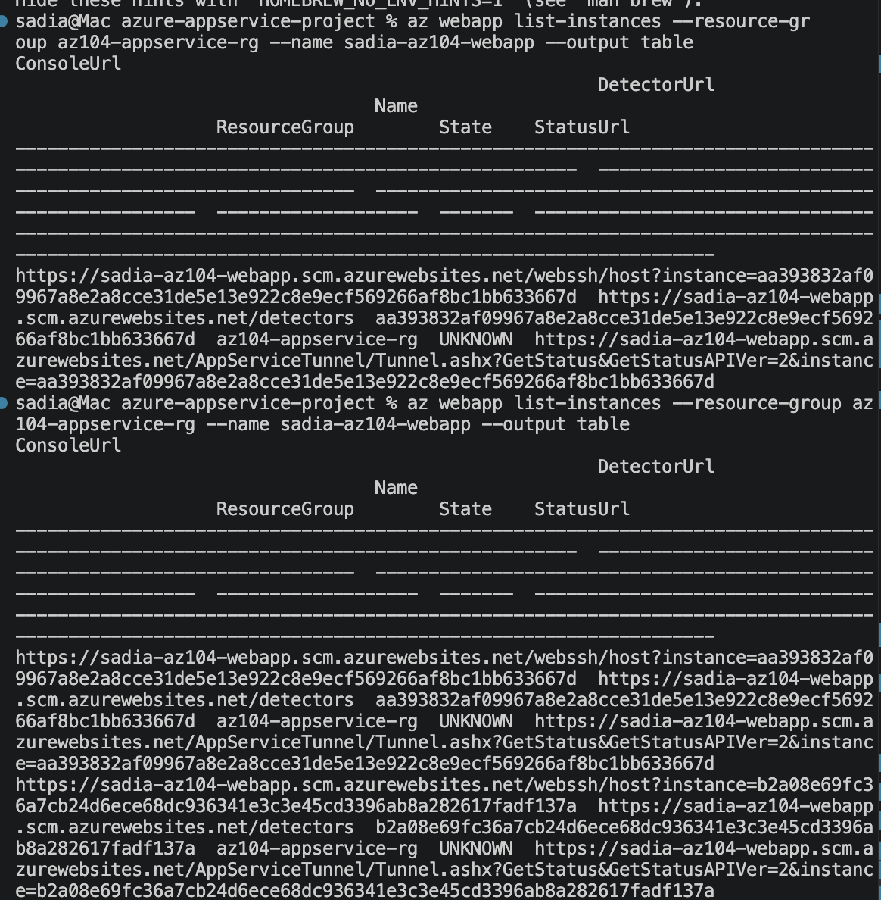

# Azure App Service: Deployment Slots, Slot Swap & Autoscaling

A hands-on Azure App Service project built while studying for the Microsoft AZ-104 (Azure Administrator Associate) certification. This project provisions a Web App on a Standard S1 App Service Plan, deploys different code to production and a staging slot, performs a zero-downtime slot swap, and configures + tests CPU-based autoscaling with real generated load.

## Overview

This project demonstrates the core App Service skills covered in the AZ-104 exam and the "Scale apps in Azure App Service" Microsoft Learn module:

- Provisioning an App Service Plan and Web App
- Configuring Web App deployment settings and deploying code via zip deploy
- Creating a staging deployment slot
- Deploying different code to the staging slot
- Performing a slot swap (staging → production) with zero downtime
- Configuring and genuinely testing autoscaling (not just configuring it)
- Configure backup for an App Service
- Configure networking settings for an App Service (IP access restrictions)

## Architecture
                    Internet
                        |
          sadia-az104-webapp.azurewebsites.net (production)
          sadia-az104-webapp-staging.azurewebsites.net (staging)
                        |
             Azure App Service Plan (Standard S1, Linux)
                        |
              -----------------------
              |          |          |
         instance 1  instance 2  instance 3
         (Node.js)   (autoscale) (autoscale)

## Prerequisites

- An Azure account (built on Azure for Students)
- Azure CLI installed and logged in (`az login`)
- Node.js app, no external dependencies needed

## Project Structure

| File/Folder        | Purpose                                                |
|---------------------|---------------------------------------------------------|
| `deploy.sh`         | Provisions all Azure resources and deploys both slots  |
| `cleanup.sh`        | Deletes all resources to avoid ongoing cost            |
| `production-app/`   | Code deployed to the production slot (blue page)       |
| `staging-app/`      | Code deployed to the staging slot (orange page)        |
| `screenshots/`      | Proof-of-work screenshots from the live deployment      |

## How to Deploy

```bash
git clone https://github.com/YOUR-USERNAME/azure-appservice-slots-project.git
cd azure-appservice-slots-project
az login
./deploy.sh
```

## Screenshots
production and staging stages





## Testing Autoscale (with real load, not just config)

Rather than only configuring an autoscale rule and documenting the settings, this project actually triggers a real scale-out event using `hey`, a load-generation tool, to send sustained concurrent traffic at the production URL:

## Backup & Networking

**Backup:** configured a Standard-tier App Service to back up to an Azure Storage container using a time-limited SAS URL, then triggered and verified a real manual backup (`az webapp config backup create` / `... list`).

**Networking:** added an IP-based access restriction rule allowing only a single trusted IP address, with the default action for all other traffic set to Deny (`az webapp config access-restriction add` + `ipSecurityRestrictionsDefaultAction=Deny`).





```bash
hey -z 8m -c 200 https://sadia-az104-webapp.azurewebsites.net/
```

Instance count was monitored in a separate terminal throughout:

```bash
az webapp list-instances --resource-group az104-appservice-rg --name sadia-az104-webapp --output table
```

Observed result: instance count went from 1 to 2  after roughly 6-7  minutes of sustained load, confirming the `CpuPercentage > 70 avg 5m` rule genuinely triggered a scale-out, not just a saved configuration.




## Troubleshooting / Lessons Learned

- **Runtime version drift:** the tutorial-standard `NODE:20-lts` runtime string failed with "Linux Runtime not supported," since Node 20 has since been deprecated on App Service. Used `az webapp list-runtimes --os-type linux` to find the current supported versions and switched to `NODE|24-lts` (note the pipe separator instead of colon, which Azure's newer CLI output uses). Good reminder that Azure's supported runtime list changes over time, always verify against the live list rather than trusting older tutorials.
- **Standard tier requirement:** deployment slots and autoscaling are not available on Free or Basic App Service plan tiers, Standard (S1) or higher is required, a real cost/feature trade-off worth knowing for the exam.
- **CLI parameter inconsistency:** `az webapp config backup create` unexpectedly requires `--webapp-name` instead of the `--name` shown in Microsoft's own documentation example, a small but real inconsistency across `az webapp` subcommands worth knowing before copy-pasting docs blindly.
- **IPv6 vs IPv4:** `curl ifconfig.me` returned an IPv6 address by default on this network, which needs `/128` CIDR notation instead of `/32`. Used `curl -4` to force an IPv4 address for simplicity.
## Cleanup

```bash
./cleanup.sh
```

## Skills Demonstrated (AZ-104 / Microsoft Learn objectives)

- Create an Azure web app
- Create a staging deployment slot
- Configure Web App deployment settings
- Deploy code to the staging deployment slot
- Swap the staging slot into production
- Configure and test autoscaling of an Azure web app

By Sadia Chaudhry
